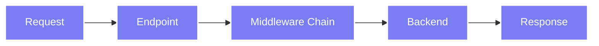

# Harmony Proxy

A secure, pluggable proxy for data meshes, with first-class healthcare support (FHIR, DICOM/DICOMweb, JMIX).

## Overview

Harmony Proxy is an extensible data mesh proxy/gateway for heterogeneous systems. It routes requests through configurable endpoints, middleware, and services/backends to connect systems securely.

## Who Is This For?

- **Platform teams** building data meshes or integration hubs (healthcare and beyond)
- **Developers** integrating HTTP/JSON services and healthcare protocols (FHIR, DICOM/DICOMweb)
- **Operators** who need auditable, configurable request/response pipelines

## Architecture

Harmony uses a pipeline architecture:

1. **Endpoints** - Define public-facing routes and protocols
2. **Middleware** - Process and transform requests/responses in order
3. **Backends** - Perform the actual work (HTTP calls, DICOM operations, etc.)

All components are configured via TOML files and can be hot-reloaded.

## Runbeam Architecture

The Harmony proxy architecture defines how users, organisations, endpoints, and services interact within the Runbeam network. The model separates responsibilities into clear abstractions for routing, policy enforcement, and inter-organisation communication.

### Users, Teams, and Orgs (these are NOT part of Harmony)

* **Users** belong to **Teams**.
* **Teams** are grouped into **Orgs**, which are the fundamental unit of organisation.
* **Orgs** (and sub-groups) organise endpoints. By default, all endpoints within an Org or Group can communicate.
* Policies can restrict communication further. Endpoints cannot be shared outside their Org, but Orgs can be members of multiple Groups.

### Gateway and Endpoint

* A **Gateway** represents a Harmony entry point. It maps to an IP or DNS address (this project)
* An **Endpoint** attaches to a Gateway and registers with Runbeam. Endpoints have a globally unique URI in the Runbeam network, allowing routing without needing the underlying Gateway address.

### Service

* **Services** are the backend applications or systems behind a Gateway.
* Each Service declaration specifies which backend services are exposed on an Endpoint.
* This tells Runbeam which services are available for routing requests.

### Pipeline

* A **Pipeline** handles the flow of traffic between Endpoints and Services.
* Pipelines are designed for inter-organisation communication. They use **Network Endpoints**, which behave like regular Endpoints but are specialised for network-level traffic.
* Pipelines can be extended with:
    * **Transforms** – perform protocol or payload modifications.
    * **Policy + Rules** – enforce access control (e.g., “can Endpoint A talk to Endpoint B?”).

### Network

* A **Network** is a higher-level abstraction built on Pipelines, designed for inter-organisation connectivity and routing.
* Networks allow secure, policy-controlled communication between different Orgs while leveraging the same Endpoint/Gateway structure.

## Status

Harmony Proxy is under active development. For more information, visit [harmonyproxy.com](https://harmonyproxy.com).

## Next Steps

- [Quick Start →](./quickstart) - Get Harmony running in 5 minutes
- [Installation →](./installation) - Detailed installation guide
- [Configuration →](./configuration/) - Learn about configuration options
